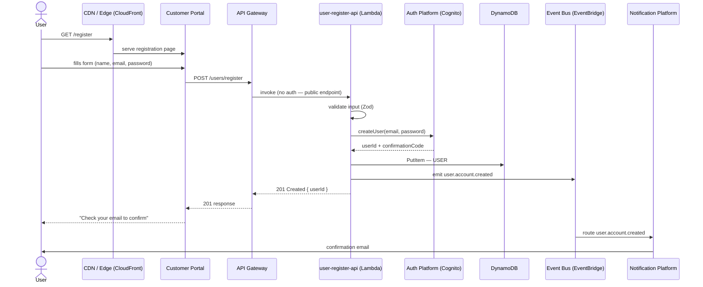
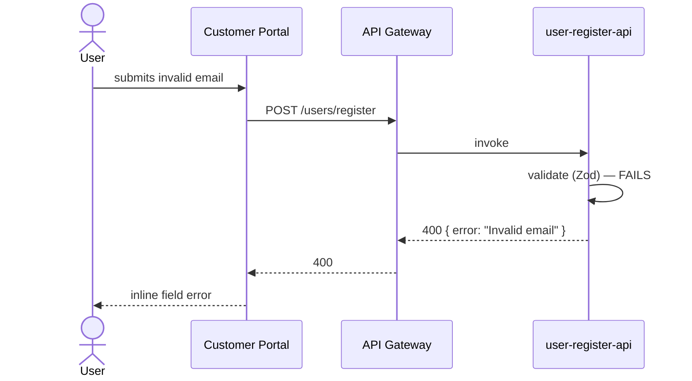
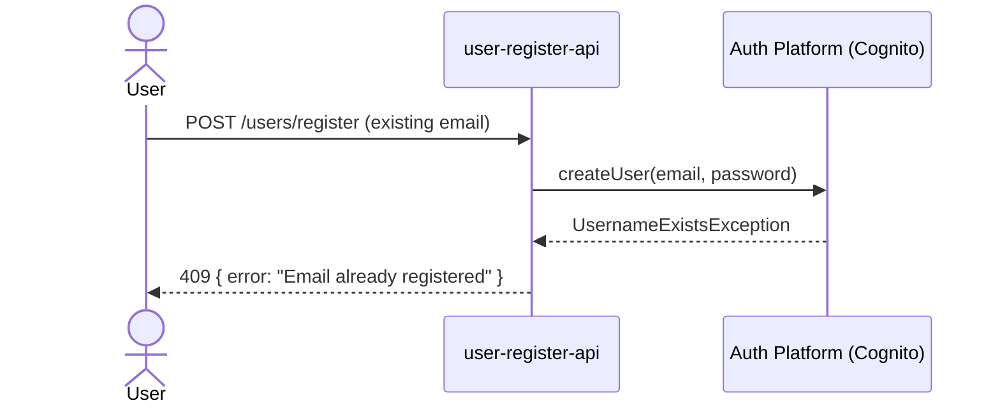
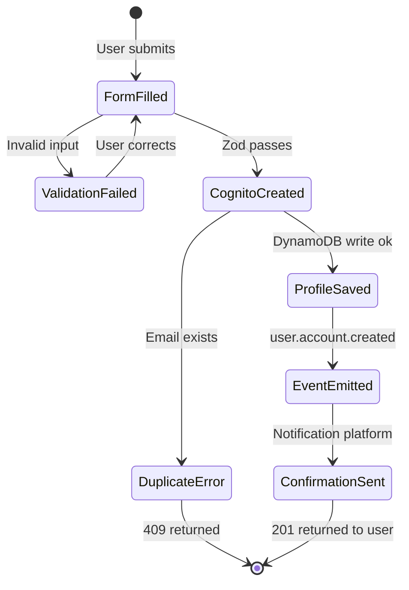

<!-- Generated by /diagram flow "user registration" — 2026-04-01 -->
<!-- Input used: architecture/system-map.md -->

# Flow: User Registration

This diagram was **generated as output** by Claude after reading `system-map.md`.
It shows how the registration flow uses the existing platform layers.

---

## Happy Path

---

## Validation Failure Path

---

## Duplicate Email Path

---

## State Machine

---

## Platform components used

| Platform layer | Component                  | Role                                 |
| -------------- | -------------------------- | ------------------------------------ |
| Infrastructure | API Gateway                | Routes POST /users/register          |
| Infrastructure | Lambda (user-register-api) | Business logic + validation          |
| Application    | Auth Platform (Cognito)    | User identity creation               |
| Data           | DynamoDB                   | Profile persistence                  |
| Data           | EventBridge                | user.account.created event           |
| Application    | Notification Platform      | Confirmation email                   |
| Product        | Customer Portal            | Registration UI (uses Design System) |

---

## What to build next (derived from this diagram)

| Command                       | What it creates                    |
| ----------------------------- | ---------------------------------- |
| `/lambda user-register-api`   | The handler + Terraform module     |
| `/event user.account.created` | Zod schema + typed publisher       |
| `/component RegistrationForm` | Form UI using design system tokens |
