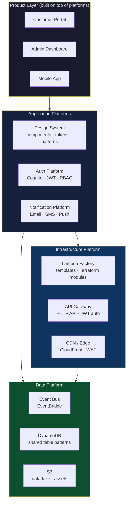
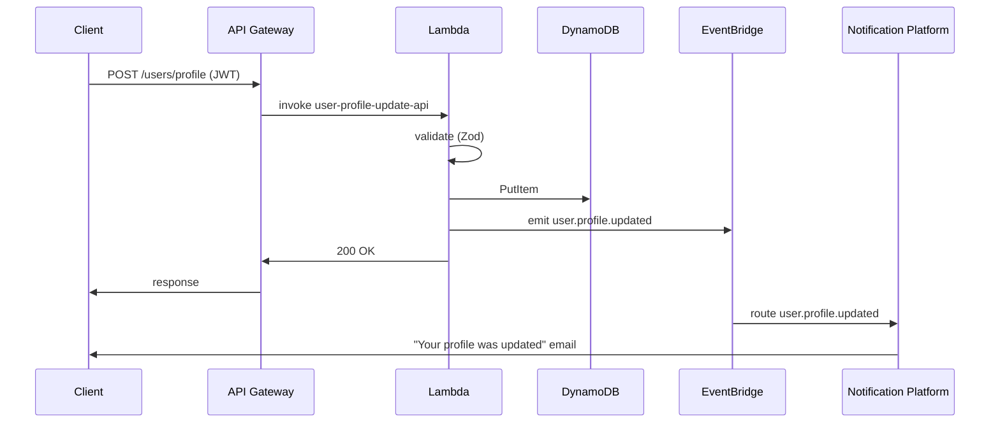
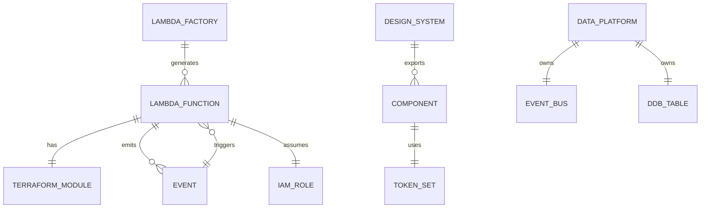
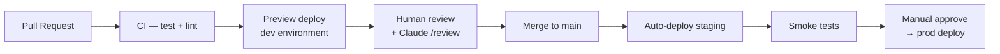

# System Architecture Map

> This file is read by Claude before making any cross-platform change.
> If your change affects a relationship shown here, update the diagram.
> Mermaid diagrams here are INPUT — they describe the current state of the system.

---

## Platform Layers

---

## Event Flow

---

## Cross-Platform Contracts

---

## Deployment Pipeline

---

## How to use these diagrams

| Use case              | What to do                                                                  |
| --------------------- | --------------------------------------------------------------------------- |
| Building a new Lambda | Read Event Flow — understand where it fits                                  |
| Adding a new event    | Read Event Flow + Cross-Platform Contracts — update both if needed          |
| New UI component      | Read Platform Layers — confirm it belongs in Design System or product layer |
| New platform          | Read Platform Layers — update the diagram before writing any code           |

Claude will read this file when you run `/lambda`, `/component`, `/api`, or `/diagram`.
