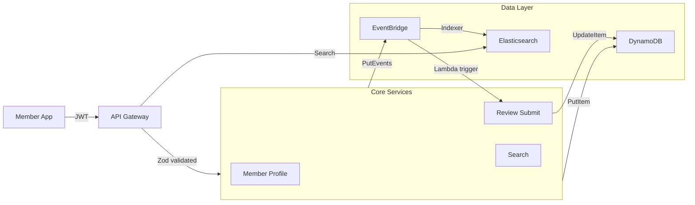

# Platform Architecture

This document provides an overview of the consumer platform system design and how services interact.

---

## Core Domains

The platform is organized around these business domains:

### 1. **Membership**

Handles member lifecycle: signup, authentication, subscription, entitlements.

**Key services:**

- `member-profile-get-api` — Retrieve member profile data
- `member-subscribe-api` — Initiate new subscription
- `member-access-control` — Evaluate tier-based permissions
- `member.subscription.created` — Event fired on signup
- `member.subscription.cancelled` — Event fired on churn

**Data store:** DynamoDB table `members`

---

### 2. **Reviews**

Manage collection and aggregation of product reviews by members.

**Key services:**

- `review-submit-api` — Create new product review
- `rating-aggregate-event` — Update product rating aggregates
- `review.submitted` — Event fired on new review
- `product.rating.updated` — Event fired when avg rating changes

**Data stores:**

- DynamoDB table `reviews` (individual reviews)
- DynamoDB table `products` (rating aggregates, denormalized)

---

### 3. **Search & Discovery**

Full-text search over products, reviews, and articles.

**Key services:**

- `search-products-api` — Search reviewed products with filters
- `search-indexer-event` — Rebuild Elasticsearch indexes on changes
- Elasticsearch domain `product-index`

**Data stores:**

- Elasticsearch (search index)
- S3 (backup of index snapshots)

---

### 4. **Recommendations**

Personalized product recommendations based on review history and member tier.

**Key services:**

- `recommendations-get-api` — Fetch recommendations for member
- `recommendation-compute-scheduled` — Batch compute job (daily)
- SageMaker notebook for model evaluation

---

### 5. **Notifications**

Asynchronous email and push notifications.

**Key services:**

- `notification-send-async` — Process notification queue
- `email-template-store` — Manage email templates (S3)
- SQS queue `notifications` (outbound)
- SNS topic `alerts` (critical)

---

## Data Platform (Backbone)

```
Member Action → EventBridge → Lambda Processors → DynamoDB
                           ↓
                      S3 (Data Lake)
                      Analytics DB
```

**Event Bus:** `platform-events` (central)

**Key Events:**

- `member.*` — Membership lifecycle
- `review.*` — Review submissions and changes
- `product.*` — Product metadata changes
- `transaction.*` — Billing and payments

---

## Infrastructure Platform

All services are deployed via Terraform modules in `platforms/infrastructure/modules/`.

**Deployment stages:**

1. Data platform (tables, event bus)
2. Infrastructure (Lambda roles, VPC, API Gateway)
3. Application services (individual Lambdas)

**Build & Deploy:**

- TypeScript → dist/ (esbuild, source maps)
- Terraform validate → plan → apply (in CI/CD)
- Blue/green deployments for prod

---

## Authentication & Authorization

- **Auth layer:** Cognito User Pool
- **JWT tokens:** 1-hour expiry, refreshable
- **Authorization:** Cognito groups map to subscription tiers
- **Service-to-service:** IAM roles (SigV4)

---

## Monitoring & Observability

| Layer   | Tool                           |
| ------- | ------------------------------ |
| Logs    | CloudWatch (30-day retention)  |
| Traces  | X-Ray (active on all Lambdas)  |
| Metrics | CloudWatch (custom dashboards) |
| Alerts  | SNS topic `alerts-prod`        |

---

## High-Level Data Flow



---

## Disaster Recovery

- **Primary region:** eu-west-1
- **DR region:** us-east-1
- **RTO:** 1 hour
- **RPO:** 15 minutes

DynamoDB replication, S3 cross-region backup, and EventBridge redundancy are configured.
